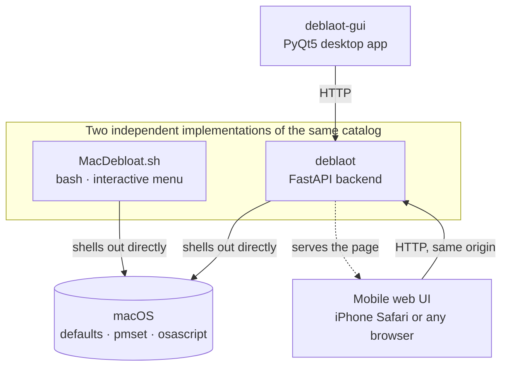

<div align="center">

# MacDebloat

**Declutter and customize macOS — from the Terminal, a REST API, a desktop app, or your iPhone.**

[](LICENSE)
[](#four-ways-in)
[](MacDebloat.sh)
[](deblaot/)

</div>

<p align="center">
  
  &nbsp;&nbsp;&nbsp;
  
  &nbsp;&nbsp;&nbsp;
  
</p>
<p align="center"><em>Same 30 tweaks, four doors in: a Terminal menu, a desktop app, and your iPhone.</em></p>

---

MacDebloat began as a straight macOS port of the popular Windows tool [Win11Debloat](https://github.com/Raphire/Win11Debloat). It's grown into a small, honest family of tools built around one shared catalog: turn off telemetry and personalized ads, opt out of Siri data sharing, remove the five bundled apps Apple actually lets you remove, tidy up the Dock and Finder — and always know exactly how to undo whatever you just did.

Every interface here shares the same catalog and the same values: nothing touches System Integrity Protection or the sealed system volume, nothing weakens security to save you a click, and every change is logged before it's made so it can be put back.

## Table of contents

- [Quick start](#quick-start)
- [Four ways in](#four-ways-in)
- [Features](#features)
- [How much does this actually free up?](#how-much-does-this-actually-free-up)
- [Design principles](#design-principles)
- [Why this isn't a 1:1 port](#why-this-isnt-a-11-port)
- [Project structure](#project-structure)
- [Contributing](#contributing)
- [Credits & license](#credits--license)

## Quick start

No install, no dependencies — just Terminal and this repo:

```bash
git clone https://github.com/<your-username>/<your-repo>.git
cd <your-repo>
bash MacDebloat.sh
```

Or, once you've pushed this to your own repo, a one-liner like the original project's:

```bash
bash -c "$(curl -fsSL https://raw.githubusercontent.com/<your-username>/<your-repo>/main/MacDebloat.sh)"
```

Use `bash -c "$(curl ...)"`, not `curl ... | bash` — piping breaks the interactive menu, because bash ends up reading your menu choices from the same stream as the script itself.

Want the API, the desktop app, or the phone version instead? Jump to [Four ways in](#four-ways-in).

## Four ways in

The bash script is the reference implementation — it's what every other interface's `defaults`/`pmset` commands are ported from — but it's not the only way to drive the same 30 tweaks:



| | Best for | Needs |
|---|---|---|
| **[`MacDebloat.sh`](MacDebloat.sh)** | Running it once, no setup, no trust required beyond reading a bash script | Nothing — macOS ships everything it uses |
| **[`deblaot/`](deblaot/)** | Scripting, automation, or building your own frontend against a documented REST API | Python 3.10+ |
| **[`deblaot-gui/`](deblaot-gui/)** | A native-feeling desktop app — sidebar, cards, one-click Apply | Python 3.10+, PyQt5, and `deblaot` as a sibling folder |
| **Mobile web UI** (part of `deblaot/`, see [its README](deblaot/README.md#mobile-ui--network-access)) | Triggering tweaks from your iPhone (built and tested against an iPhone 15's exact 393×852 viewport) | `deblaot` running with `DEBLAOT_HOST=0.0.0.0`, same Wi-Fi, and its access token |

All four read from the same 30-tweak catalog. None of them re-implement the underlying logic — the GUI and the mobile UI are both thin clients over `deblaot`'s API, and `deblaot` mirrors `MacDebloat.sh`'s exact `defaults` domains, keys, and values rather than reinventing them.

## Features

| Category | What it does |
|---|---|
| **Privacy & Analytics** | Turn off Mac analytics/crash-report sharing, personalized Apple advertising, Siri data sharing, Siri Suggestions in Spotlight, and Trash's 30-day auto-delete. |
| **Siri & Apple Intelligence** | Disable Siri outright, or (experimentally) Apple Intelligence itself. |
| **System, Power & Input** | Kill mouse acceleration, disable Power Nap and Wake-for-network during sleep, swap the accent-character popup for plain key repeat. |
| **Software Update** | Stop background update *checking* and *downloading* nagging — critical security patches are deliberately left alone. |
| **Appearance** | Dark Mode, reduced transparency, reduced motion, battery percentage in the menu bar. |
| **Dock & Menu Bar** | Auto-hide, hide recents, minimize-to-icon, reposition, reset Launchpad's layout. |
| **Finder & Windows** | Show all extensions and hidden files, full path in the title bar, path/status bars, default window location, list view by default. |
| **Remove Bundled Apps** | Pages, Numbers, Keynote, iMovie, GarageBand — the only five Apple apps Apple itself allows you to delete. |

Run `bash MacDebloat.sh --list`, or `GET /tweaks` on the API, for the exact, current list at any time — both read from the same source of truth.

## How much does this actually free up?

Two honest answers instead of one polished-looking one:

<p align="center">
  
</p>

**Disk space** comes almost entirely from **Remove Bundled Apps** — everything else in this project is a privacy, appearance, or system-behavior change with no disk footprint either way. Pages, Numbers, and Keynote are roughly 0.6 GB each; iMovie is about 3.3 GB; GarageBand ranges from ~1.5 GB up to 10+ GB depending on how much of its optional sound library you've downloaded. These are approximate, current-as-of-early-2026 figures from Mac App Store listings, not a lab-measured before/after of the whole tool — your actual numbers will vary by macOS version and what you've already deleted.

<p align="center">
  
</p>

**Memory** doesn't get a chart, on purpose. None of the 30 tweaks meaningfully free up RAM — disabling Siri or analytics reporting might shave a background process here or there, but not by an amount worth measuring or claiming. Making up a number for a graph would be exactly the kind of faked parity this project tries to avoid elsewhere (see [Why this isn't a 1:1 port](#why-this-isnt-a-11-port)). If that changes — a future tweak with a real, measurable memory footprint — it'll get charted the same sourced way as the disk-space numbers above, not before.

## Design principles

- **Never touch what protects you.** No SIP, no sealed system volume, no Gatekeeper, no FileVault. If a tweak would require weakening one of those, it's out of scope, full stop.
- **Nothing changes without a way back.** `MacDebloat.sh` logs a revert command before every write; `deblaot` logs a structured row to SQLite before every write. Both exist so `--revert` (or the History tab) can undo a single tweak, a whole category, or an entire run.
- **Security patches are not "bloat."** Software Update tweaks only touch background nagging and timing — critical security/XProtect updates are deliberately left alone, the same way the original Windows tool never touches Windows Defender.
- **Say when something doesn't have a real answer.** The Apple Intelligence toggle is marked experimental because there's no Apple-documented command for it — only a reverse-engineered key that's changed across updates before. Window tiling opens System Settings instead of guessing at a command that might silently do nothing. Better to be honest than to fake parity.
- **A network-exposed API that can trigger admin prompts needs real protection.** The mobile UI requires binding `deblaot` beyond localhost — the moment you do, a token is generated automatically and enforced for every non-local request, so opening this up to your phone doesn't also open it up to your Wi-Fi network.

## Why this isn't a 1:1 port

Windows and macOS don't expose the same knobs, so a few things are intentionally left out rather than faked:

- **BitLocker auto-encryption** — macOS doesn't silently auto-enable FileVault the way Windows can auto-enable Device Encryption, so there's nothing to turn off.
- **Fast Startup** — macOS has no hybrid shutdown/hibernation mode to disable.
- **Delivery Optimization** (P2P update sharing) and **auto-installing companion apps** — no macOS analog.
- **Xbox Game Bar** — no macOS analog.

And two things are handled more conservatively than a literal port would suggest:

- **App removal is limited to Pages, Numbers, Keynote, iMovie, and GarageBand.** Every other bundled Apple app lives on the cryptographically sealed system volume and cannot be safely deleted — that's a macOS security feature, not a limitation of this project. Removed apps go to the Trash, not permanent deletion, and all five are free to redownload from the App Store regardless.
- **The Apple Intelligence toggle is experimental**, and window tiling isn't scripted at all — see [Design principles](#design-principles) above.

## Project structure

```
.
├── MacDebloat.sh              # the bash script — reference implementation
├── README.md                  # you are here
├── LICENSE
├── Assets/Images/menu.png
│
├── deblaot/                   # FastAPI backend + mobile web UI
│   ├── app/                   # tweak catalog, execution engine, SQLite history, API routes
│   ├── static/                # the mobile UI (served at '/' by the backend itself)
│   ├── run.sh
│   └── README.md
│
└── deblaot-gui/                # PyQt5 desktop app
    ├── deblaot_gui/            # window, API client, backend auto-launcher
    ├── main.py
    └── README.md
```

Each subproject's README covers its own setup, internals, and (for `deblaot`) the full API reference in depth — this file is the map, not the territory.

## Contributing

Issues and pull requests are welcome. A few things that'll make a PR easy to review:

- If you're adding or changing a tweak, update it in **both** `MacDebloat.sh` and `deblaot/app/tweaks.py` — they're independent implementations of the same catalog and are expected to agree.
- New `defaults` domains/keys should note their source (a specific macOS version, a compliance benchmark like CIS/DISA, or a well-established community reference) in a comment — this ecosystem is entirely reverse-engineered by the community, since Apple doesn't document most of it.
- Anything destructive (removing something, changing security-relevant settings) should default to *asking first*, the same way `remove-bundled-apps` and the experimental Apple Intelligence toggle do.

## Credits & license

Concept and menu-driven feel inspired by [Win11Debloat](https://github.com/Raphire/Win11Debloat) by Raphire. No code is shared between the two projects — Windows and macOS are configured through entirely different mechanisms (registry/Group Policy vs. `defaults`/`launchctl`).

MIT — see [LICENSE](LICENSE).
